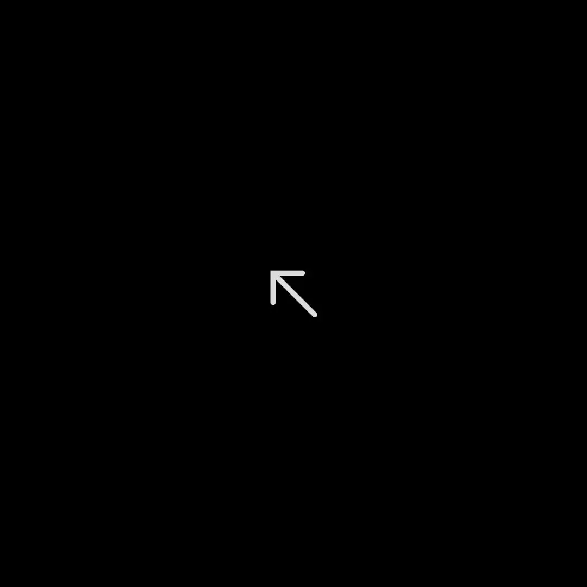

# Traj-WM: A Trajectory-Centric World Model for Surgical Trajectory Forecasting

Accurate forecasting of **surgical instrument trajectories** is critical for real-time intra-operative guidance and proactive hazard mitigation. However, directly applying generic video world models to surgery is challenging: endoscopic scenes are visually complex, while feasible instrument motion follows strict procedural and physical constraints—making unconstrained future synthesis unreliable for trajectory prediction.

**Traj-WM** is a **trajectory-first world model** for surgical robotics. It learns a **unified latent space** encoding both procedural context and motion-relevant state. Future video generation is used as **auxiliary supervision**, while an **Inverse Dynamics Model (IDM)** maps latent transitions to **explicit future trajectories**, grounding predicted dynamics into physically/procedurally consistent instrument motion.

> **Code & pretrained models: Coming Soon.**  
> This repo currently focuses on qualitative results and key quantitative highlights.

---

## 🔥 Qualitative Results

### Training Strategy (progressive multi-stage)

  

**Trajectory RMSE (↓)** on 854×480 images:
- Stage-1: **70.28 px**
- Stage-2: **54.96 px**
- Stage-3: **25.87 px**

---

### Predicted Future Video (Top: prediction, Bottom: GT)

  

> The first row shows predicted future frames; the second row shows ground truth.

---

## 🎯 Downstream Transfer
Traj-WM’s learned representation adapts to multiple surgical perception tasks, providing complementary evidence that the world model captures clinically meaningful semantics beyond trajectory forecasting.

  

### Instrument Segmentation
- **Dice:** **0.861**
- **IoU:** **0.840**  
Despite using a simplified architecture (**single decoder**), Traj-WM outperforms **UnetBinary** (IoU **0.689%**, Dice **0.816**).

### Surgical Triplet Recognition
- **mAP_macro:** **0.365**  
Improves over the official baseline (**0.299**).

---

## 🧪 Generation / Data Augmentation Quality (LPIPS ↓)
Lower LPIPS indicates better perceptual similarity. Traj-WM achieves the best LPIPS among comparable methods.

  

